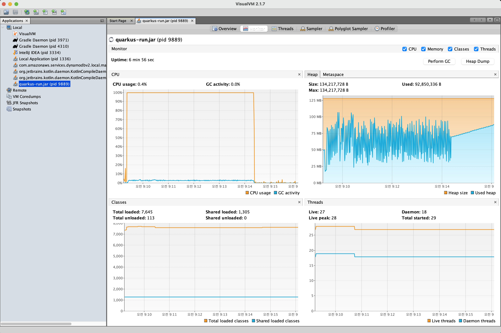
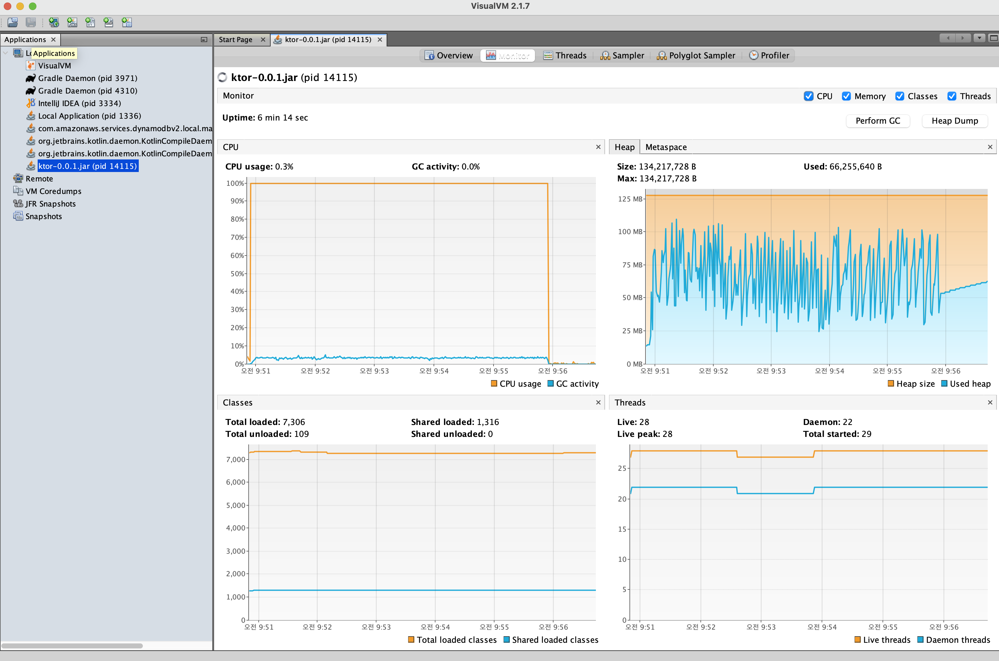

# 성능테스트

## 소개

- Redis 를 활용한 Spring WebFlux 와 Undertow 의 기본 성능 테스트
- 추가로 Quarkus 및 Vert.x 를 테스트

## 구성

- JDK21, SpringBoot 3.2.1
- M1 MacBook Pro 14 32G
- JVM HeapSize 128M, ActiveProcessorCount 를 2개로 제약
- wrk 명령어를 사용하여 부하 인입
- VisualVM 을 통한 모니터링
- Redis 에서 key 3개를 조회해 보는 기능 테스트

```shell
# thread: 6
# connection: 500
# duration: 5 minutes

# undertow
wrk -t 6 -c 500 -d 300s http://localhost:19001/undertow

# webflux
wrk -t 6 -c 500 -d 300s http://localhost:19002/webflux
```

## 결과

### Undertow

```shell
Running 5m test @ http://localhost:19001/undertow
  6 threads and 500 connections
  Thread Stats   Avg      Stdev     Max   +/- Stdev
    Latency    22.17ms    4.11ms 180.85ms   88.29%
    Req/Sec     3.77k   462.25     4.78k    75.08%
  6752558 requests in 5.00m, 1.18GB read
  Socket errors: connect 0, read 726, write 0, timeout 0
Requests/sec:  22504.78
Transfer/sec:      4.03MB
```


### Webflux

```shell
Running 5m test @ http://localhost:19002/webflux
  6 threads and 500 connections
  Thread Stats   Avg      Stdev     Max   +/- Stdev
    Latency    12.90ms    6.15ms 272.27ms   78.74%
    Req/Sec     6.55k   754.23    10.96k    81.65%
  11738155 requests in 5.00m, 1.18GB read
  Socket errors: connect 0, read 1611, write 28, timeout 0
Requests/sec:  39119.18
Transfer/sec:      4.03MB
```


### Quarkus

```shell
Running 5m test @ http://localhost:19003/quarkus
  6 threads and 500 connections
  Thread Stats   Avg      Stdev     Max   +/- Stdev
    Latency     8.89ms    2.94ms 137.82ms   88.17%
    Req/Sec     9.41k   727.58    12.86k    92.35%
  16851429 requests in 5.00m, 1.91GB read
  Socket errors: connect 0, read 843, write 4, timeout 0
Requests/sec:  56154.07
Transfer/sec:      6.53MB
```



### Ktor

```shell
Running 5m test @ http://localhost:19005/ktor
  6 threads and 500 connections
  Thread Stats   Avg      Stdev     Max   +/- Stdev
    Latency     9.55ms    3.61ms 165.12ms   85.65%
    Req/Sec     8.79k     0.86k   10.64k    89.89%
  15747581 requests in 5.00m, 1.54GB read
  Socket errors: connect 0, read 369, write 0, timeout 0
Requests/sec:  52475.63
Transfer/sec:      5.25MB
```


